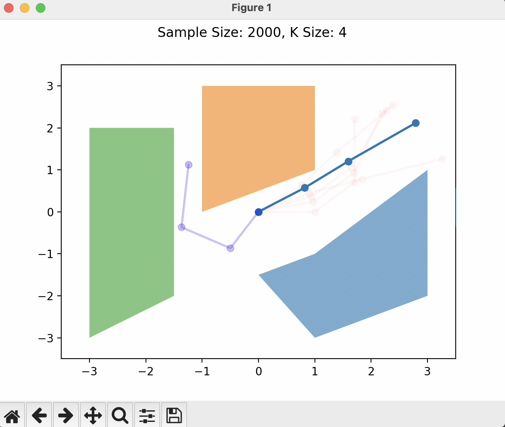
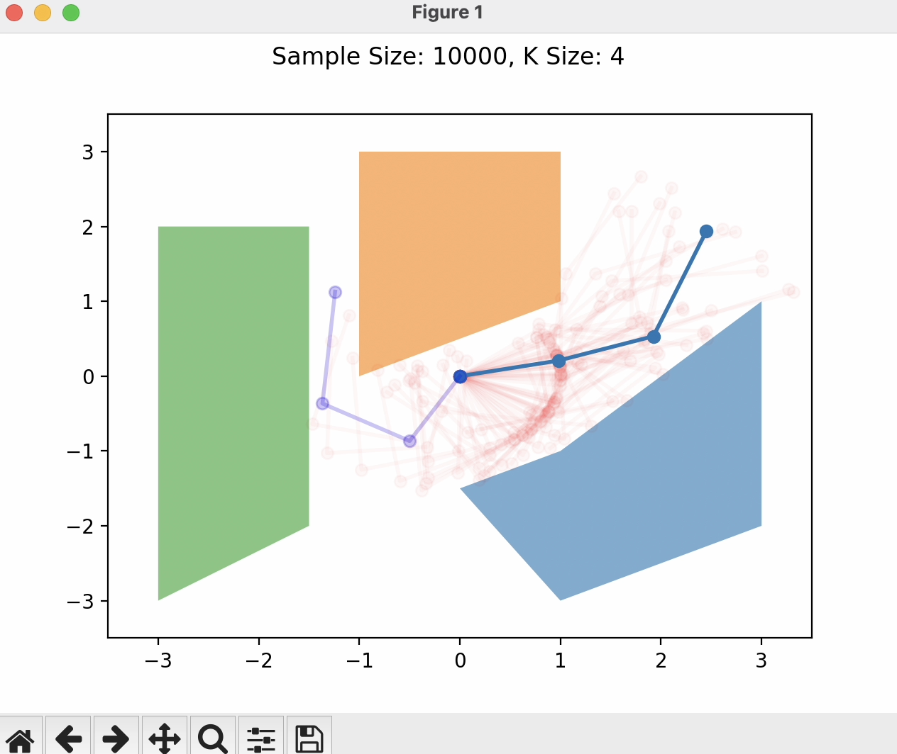
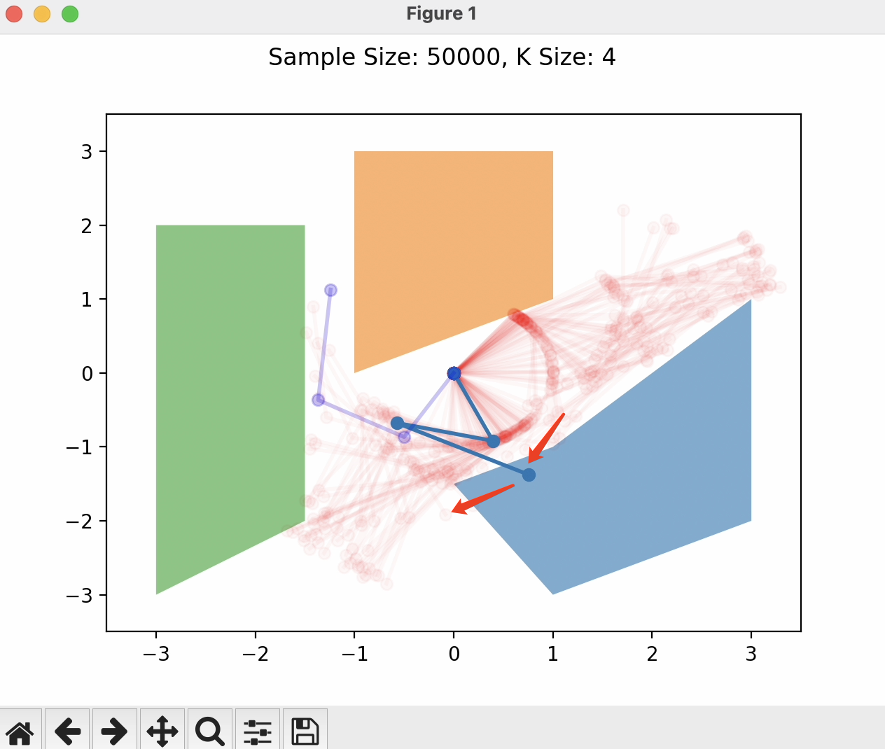
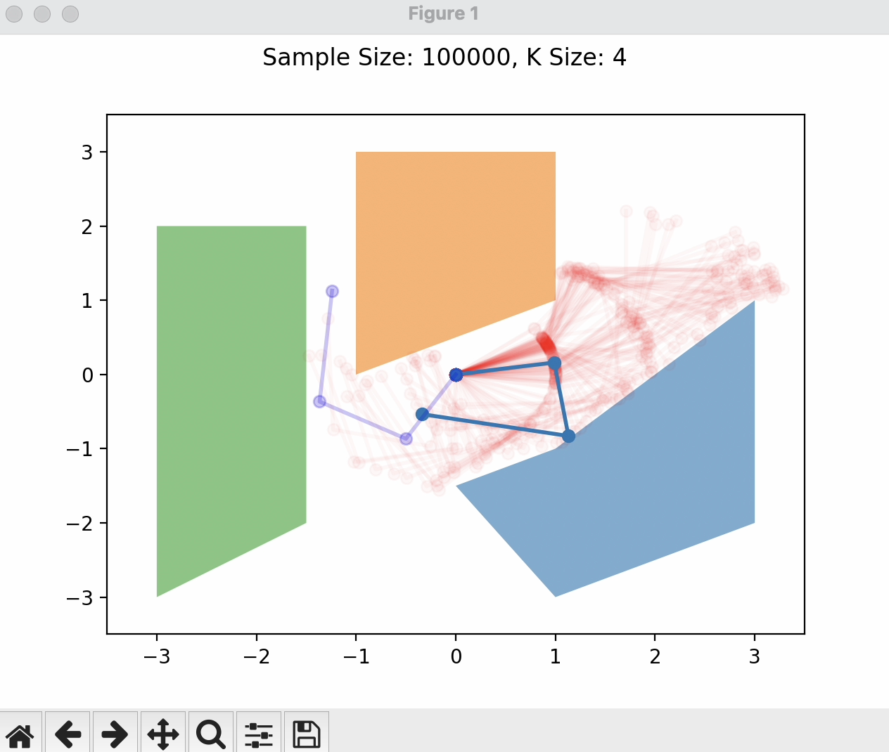

# PRM-Based Motion Planning for Planar Robot Arms
This project involves implementing a Probabilistic Roadmap (PRM) motion planner for planar robot arms of varying configurations (2R, 3R, and 4R). The primary objective is to simulate and analyze the motion planning capabilities of these robotic arms within environments containing various obstacles.

**Robot Arm Models and Kinematics**

In my simulation, I focused on planar robotic arms with 2, 3, and 4 joints. The state of each arm in my model is defined by the angles of its joints. These angles determine the position of each segment of the arm in a 2D plane, representing the rotational degrees of freedom for each joint.
 - ##### Kinematic Models
   - In my kinematics function, I iteratively compute the `(x, y)` positions of each joint and the end effector, starting from the base of the arm positioned at `(0, 0)`. For each joint indexed at i, its position is derived from the previous joint's position, considering the link's length and the cumulative angle up to that joint.
 - ##### Visualization
   - I incorporated visualization capabilities using matplotlib to plot the configurations of the robotic arm in a 2D plane.
   - In the `init_plot()` method, I set up the plotting environment, and then in the `display()` method, I plot the arm based on the joint positions computed by the kinematics function. This visual representation helps in understanding how different joint angles affect the arm’s configuration.
   - I used `FuncAnimation()` from matplotlib.animation to create dynamic visualizations of the arm's movements. This feature is particularly useful in showing how the arm navigates through different configurations, especially when implementing pathfinding algorithms to avoid obstacles.
   - The `interpolate_configurations()` function in my code generates intermediate configurations between two given states, providing a more fluid motion in the animation. This function creates a sequence of gradually transitioning joint angles, resulting in smoother visual movements.


**Obstacles and Collision Detection**
 - ##### Obstacle Representation
   - In my simulation, obstacles are represented as polygons using the `Polygon` class from the `shapely.geometry` module. Each obstacle is defined by a series of coordinates that outline its shape in the 2D workspace.
 - ###### Collision Detection
    - The core of my collision detection involves checking for intersections between the `line` segments representing the arm's links (created using `LineString`) and the polygonal obstacles.
    - Each arm segment is treated as a separate LineString object. The `collision_checker()` iterates through these segments and uses the `intersects()` method to determine if any segment collides with any of the obstacles.
    - To demonstrate the effectiveness of the collision detection, I included visualizations in my simulation. These visuals show the arm in various configurations, highlighting the instances where it collides with obstacles.
   

**Probabilistic Roadmap (PRM)**

  - ##### Vertex Sampling: 
    - The sampling strategy in the configuration space is crucial for effectively covering the range of possible arm positions, using `np.linalg.norm()`.
    - For each arm joint, angles are randomly generated within a defined range (e.g., `-π` to `π`). This randomness ensures a diverse set of configurations, facilitating thorough exploration of the configuration space.
    - Collision checking is integrated into the sampling process. If a generated configuration results in a collision with an obstacle, it is discarded, and a new configuration is sampled.
    - Importantly, my collision detection approach also applies to the interpolated configurations. If a `collision` is detected during `interpolation` when the arm is moving between two configuration, the algorithm regenerates a new `random_config` until a collision-free path is found.
  - ##### Local Planner
    - I implemented `find_K_nearest_neighbors()` to determine the k nearest neighbors for each vertex. This involves calculating the `Euclidean distance` between configurations and sorting these distances to find the closest neighbors.
    - Once the nearest neighbors are identified, I connected the nodes with edges and create a `graph` to model the search problem.

**Path finding**
  - ##### Uniformal_search
    - Utilizes two sets, `unvisited_nodes` and `visited_nodes`, for tracking nodes.
    - Employs a `path` dictionary to record each node's parent for path tracing.
    - Selects nodes based on their Euclidean distance to the end configuration.
    - Adds neighbors of the current node to unvisited_nodes and maps their paths.
    - If the end configuration is reached, `reconstruct_path()` backtracks to form the complete path.

### Experimental Setup and Results
  - I tested different sample sizes range from `2K` to `100K`
  - I tested different values of nearest `K` neighbors from `2` to `10`
  


#### Sample size: 2000, K = 4
With a sample size of 2000, the path created often presents challenges in interpolation, revealing the limitations of sparse sampling.

 

#### Sample size: 5000, K = 4
Increasing the sample size to 5000 improves solution quality. However, issues with interpolation still persist.

 

#### Sample size: 10000, K = 4
A sample size of 10000 shows improvements similar to 5000 samples but continues to struggle with interpolation.

 

#### Sample size: 20000, K = 4
At 20000 samples, path planning becomes more efficient and avoids the previous issues of collision during interpolation.

 

#### Sample size: 50000, K = 2
With K = 2, the planner sometimes fails to find a solution due to limited connectivity in the graph.

#### Sample size: 50000, K = 3
Setting K to 3, the path becomes more efficient, though not as optimal as higher K values.

 

#### Sample size: 50000, K = 4
At K = 4, the planning performs better than K = 3, but it faces issues with collisions during interpolation.

 

#### Sample size: 50000, K = 5
K = 5 offers efficient path planning without collision issues, presenting paths that are closely aligned.

 

#### Sample size: 100000, K = 4
A sample size of 100000 performs well, yet shows no significant improvement over 50000 samples.

 

(You can find the animation in the `animation` folder)

### Runtime - 3 arms
```
Sample Size: 2000, K = 4, runtime = 14.83 seconds
Sample Size: 5000, K = 4, runtime = 35.22 seconds
Sample Size: 10000, K = 4, runtime = 76.47 seconds
Sample Size: 20000, K = 4, runtime = 182.39 seconds
Sample Size: 50000, K = 2, runtime = 519.20 seconds - No solution
Sample Size: 50000, K = 3, runtime = 528.23 seconds
Sample Size: 50000, K = 5, runtime = 534.51 seconds
Sample Size: 100000, K = 4, runtime = 1452.82 seconds
```


### Conclusion

Generally, increasing the number of samples enhances the likelihood of the model finding a solution. A higher K value necessitates more samples to effectively support the search process. However, the random nature of sampling introduces a level of unpredictability. This means that even with a large sample size, the model may face challenges in identifying the most optimal path.

### Bonus - Literature Review
LaValle, S. M. (1998). Rapidly-exploring random trees: A new tool for path planning. Retrieved from https://msl.cs.illinois.edu/~lavalle/papers/Lav98c.pdf

notes:

- RRTs are randomized path planning techniques designed to handle non-holonomic constraints and high degrees of freedom. They expand trees incrementally in a biased way towards unexplored areas.

- RRTs have desirable properties like probabilistic completeness and can be directly applied to nonholonomic and kinodynamic planning problems. 

- The key advantage of RRTs is that they don't require connections between pairs of states/configurations. The randomized expansion leads to faster exploration and consistency in behavior.

- RRTs rely heavily on the choice of a good heuristic potential function, which becomes challenging. The vertices tend to get non-uniformly distributed.

- RRTs have been successfully applied to many complex problems in robotics including motion planning of hovercrafts, satellites, manipulators in cluttered environments, and virtual prototyping of vehicles.

- There is little hope of obtaining an efficient general path planning algorithm. RRTs mitigate this by having simple heuristics and arbitrary parameters that can be tailored for specific applications. This also facilitates adaptation to related problems.

- The probabilistic completeness of RRTs has been analyzed. Convergence rate and solution quality issues remain open problems, especially for nonholonomic and kinodynamic planning.


