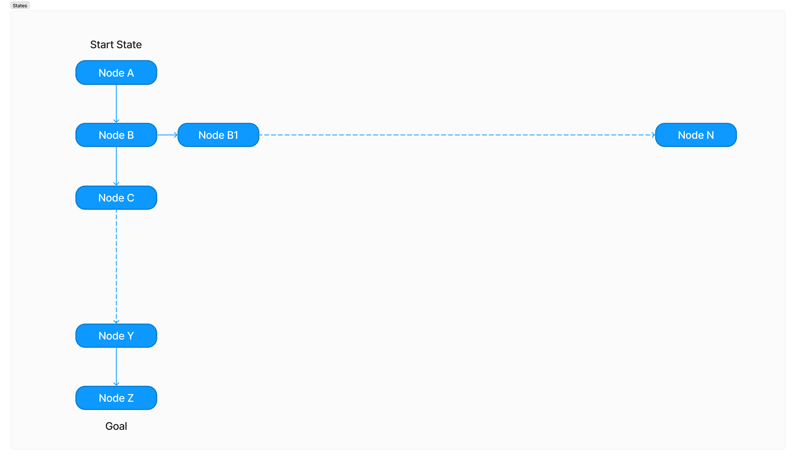

# Foxes and chickens

This problem is traditionally known as the “missionaries and cannibals” problem. Three chickens and three foxes come to the bank of a river. They would like to cross to the other side of the river. There is one boat. The boat can carry up to two animals at one time, but doesn’t row itself – at least one animal must be in the boat for the boat to move. If at any time there are more foxes than chickens on either side of the river, then those chickens get eaten. In this assignment, I implement algorithms that will make plans to get everyone across the river in time for lunch, without any chickens becoming lunch.

---

**Introduction**
   - ##### The upper bound on the number of states without considering legality.
      if there are `n` foxes, `m` chickens and a `boat` can only be either side of the bank, the number of the state should be `(n+1)×(m+1)×2` states. 
      
      e.g. if the initial state is 3 foxes, 3 chicken, 1 boat, then the number of possible states will be `4 * 4 * 2 = 32`

      
---
**Code design**
   
   - I use the class `SearchNode` to wrap state objects, keep track of the current depth, and point to parent nodes. This is a useful helper class for maintaining the search tree. The `trace_parent()` function is a backchaining function that traces the path from the goal state to the start state by following parent links.
---
**Building the model**

   - In my FoxProblem class, I've encapsulated the problem details. I've implemented:
     >- The `check()` function to determine state legality.
     >- The `get_successors()` function to find successor states.
     >- The `goal_check function()` to see if a state matches the final goal.
---     
**Breadth-first search (BFS)**

   - My BFS implementation in `bfs_search()` follows typical BFS logic. I used a `queue` to track states to explore and a `set` to keep track of visited states.
---
**Memoizing depth-first search (DFS)**

   - I've also provided a `memoizing_dfs_search()` that uses a set of visited nodes to avoid redundancy.
   - Memoizing Depth-First Search (DFS) vs. Breadth-First Search (BFS) Memory Usage:
     - **BFS**: 
      Uses a queue, which can grow significantly in large branching factors, leading to high memory usage. The space complexity is O(b d), where `b` is the branching factor and `d` is the depth.
     - **Memoizing DFS**:
      Uses a stack, which consumes less memory since it explores one path deeply before backtracking.Maintains a set of visited nodes, adding to memory usage which the space complexity is O(d). However, this is often smaller than BFS's queue in wide graphs.
---
**Path-checking depth-first search**

   - My `dfs_search()` function is recursive, as required. I've also incorporated a `path_check()` function to ensure the current path doesn't have repeated states.
   - **Path-Checking DFS**:
      - Uses a stack, typically consuming less memory since it explores one path deeply before backtracking.
      - Unlike memoizing DFS, it doesn't maintain a set of all visited nodes. Instead, it checks only the current path for repeated states, which often means even less memory usage than memoizing DFS.
      - Compared to BFS, path-checking DFS typically consumes less memory, especially in wide graphs.
   - **BFS**:
      - Uses a queue, which can grow substantially in graphs with large branching factors, leading to high memory usage.
  
      
      In the given example, path-checking DFS spends a lot of time exploring the wide side branch, making its runtime much longer compared to BFS, which systematically moves closer to the goal with each level. However, despite the longer runtime, path-checking DFS would still use less memory than BFS due to its depth-oriented nature.
---
**Iterative deepening search (IDS)**

   - For IDS, I implemented the ids_search function. This performs a depth-limited DFS multiple times, increasing depth limits until a solution is found.
   - In an iterative deepening search on a graph, it would generally make more sense to use memoizing DFS over path-checking DFS. While memoizing DFS might consume more memory due to its storage of visited nodes, the time savings from avoiding repeated exploration within the same depth iteration can be substantial. This becomes especially important in larger graphs or graphs with many cyclic paths.
---
**Tests**

   - I've set up a testing section to create FoxProblem instances with varying starting states. Then, I run BFS, DFS, IDS, and memoizing DFS on these instances to test their functionality.
   - In my test case on a large graph, IDS does took way longer than BFS.
   test case:
      >`print(bfs_search(problemXL))`
      >`print(dfs_search(problemXL))`
      >`print(ids_search(problemXL))`
      >`print(memoizing_dfs_search(problemXL))`