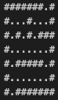

# Mazeworld
In this assignemnt, I developing a pathfinding solution for a robot navigating ASCII-represented mazes. Emphasis is on implementing the A* search algorithm, with the option to also explore Uniform-Cost-Search. The challenge amplifies with multi-robot coordination in mazes, requiring collision avoidance and fuel-efficient pathfinding. Another variant introduces a blind robot adhering to Pacman physics, aware of only the North direction, demanding heuristic-driven solutions to guide it from an unknown start to a known end position. 

**Previous work**

*Standley, T. 2010. Finding optimal solutions to cooperative pathfinding problems. In The Twenty-Fourth AAAI Conference on Artificial Intelligence (AAAI’10), 173–178.*
   - The authors have presented a novel approach to cooperative pathfinding, addressing the deficiencies of existing algorithms. Their method promises completeness, enhanced solution quality, and competitive running times, making it a significant contribution to real-time applications in various fields requiring multi-agent navigation. The introduction of an anytime algorithm also underscores the adaptability and efficiency of their proposed solution in attaining optimal outcomes within given time constraints. 
  
   - Key Takeaways:
      - Efficiency and Scalability: The MGS and OA algorithms are efficient and scalable, solving a wide range of complex problems swiftly.

      - Solution Quality: These algorithms offer a balanced trade-off between time and quality, with the ability to provide optimal or near-optimal solutions quickly.

      - Limitations: There are challenges in highly constrained environments, indicating areas for future research and optimization.

      - Practical Applications: The algorithms’ performance, especially the OA’s adaptability, makes them highly applicable in real-time scenarios like digital entertainment, robotics, and AI applications requiring efficient pathfinding solutions.

**A-star search**

`A* search` is a generalization of Uniform-Cost-Search (UCS). In UCS, I expand the node with the lowest path cost so far. In A* search, I expand the node with the lowest value of `g(n)+h(n)`, where `g(n)` is the cost from the start node to node n, and `h(n)` is the heuristic estimate of the cost from node n to the goal.

   - ##### Uniform-Cost-Search
      For UCS, I simply make the heuristic `h(n)` turn 0 so that the A* only has g(n) for the cost function. This would mean that the node's priority would be solely determined by its cost `g(n)`, making it a UCS. You can find the `null_heuristic()` in `test_mazeworld.py`
      
   - ##### Efficiently checking if a node is in a priority queue, or replacing it:
      In my implementation, I’ve used a `priority queue` to hold nodes pending expansion. While I'm aware that heaps don’t support direct and efficient checks for item existence or replacement, I have circumvented this by utilizing a `visited_cost{}` dictionary. When I encounter a state, I check this dictionary to see if it’s already been visited and what the associated cost was. If I come across a better path to a previously visited state, I simply push this new node onto the priority queue and update the visited_cost with the new, lower cost.

      Even though this method keeps the old nodes in the priority queue, it’s still efficient. When an old node is popped from the queue, I perform a quick check to compare its cost to the stored cost in `visited_cost{}`. If it doesn’t match, meaning a lower-cost path has been found, I discard the node, ensuring only the most optimal paths are considered.

      In essence, my approach allows for an efficient, though not memory-optimized, way to check and replace nodes in the priority queue, facilitated by the auxiliary `visited_cost{}` dictionary. This ensures that computational efficiency is maintained without the need to directly modify the heap.

**Multi-robot coordination**

- In my multi-robot coordination system, each robot takes its turn to move within an n x n maze. The robots' initial and goal positions are identified from the maze, which is read from a file. I employ the A* search algorithm, incorporating a heuristic function that utilizes the `Manhattan distance` to estimate the cost from the robots' current positions to their destinations, aiding in optimal path finding.

 - k robots live in an n x n rectangular maze. The coordinates of each robot are (x_i, y_i), and each coordinate is an integer in the range 0…n-1. For example, maybe the maze looks like this:  

      #######. #  
      #. . . # . . . #  
      #. #. #. ###  
      #. . . . . . . #  
      #. #####. #  
      #BC . . . . .  #  
      #A#######     

      That’s three robots A, B, C in a 6x9 maze. I’d like to get the robots to this locations:  
      
      #######A#  
      #. . . #. CB#  
      #. #. #. ###  
      #. . . . . . .  #  
      #. #####.#  
      #. . . . . . .  #  
      #.#######    

 - ##### How my multi-robot coordintion works
      - The` actions = [(1,0),(0,1),(-1,0),(0,-1),(0,0)]` are employed to ensure that robots avoid collisions. Each robot has options to move `right`, `up`, `left`, `down`, or `stay in place`, enabling a robot to wait if a move isn’t ideal, hence preventing collisions. The `get_successors()` function considers these actions to generate valid next states, ensuring that each robot only occupies permissible positions while avoiding walls and other robots. The five states in this context would be various combinations of the robots’ positions as they `navigate`, `wait`, and `avoid each other and obstacles` within the maze.
 - ##### Bonus: Have the robots move simultaneously
    - To make the robots move simultaneously, I’d extend the state space to include combinations of all robots’ positions and evaluate these collective states during the search. This would ensure that the path planning accounts for all robots moving at once, leading to a more synchronized and efficient solution.
 - #### If there are not many walls, n is large (say 100x100), and several robots (say 10), do you expect a straightforwards breadth-first search on the state space to be computationally feasible for all start and goal pairs? Why or why not?
     - **State Space**: The total number of possible states is significantly increased due to the large maze size and multiple robots. Since each robot has `n*n` possible positions in the maze, with `10` robots, we have `(n*n)^10` potential states, not accounting for obstacles and invalid positions due to collisions. Thus, BFS becomes computationally infeasible due to the overwhelming time complexity and memory requirements needed to explore such a vast state space exhaustively.

 - ##### Describe a useful, monotonic heuristic function for this search space. Show that your heuristic is monotonic. See the textbook for a formal definition of monotonic.
     - The `Manhattan distance` serves as a reliable heuristic, proving to be both `admissible` and `consistent`. It’s monotonic as it satisfies the condition `h(n) ≤ c(n, a, n') + h(n')`, meaning the estimated cost to the goal from any node n is not greater than the cost of reaching successor n' plus the estimated cost from n' to the goal.
 - ##### give five cool examples from 5x5 to 40x40, describe why they are interesting
     - 5x5 Maze with 3 Robots: The limited space and robot interactions make path planning intricate.
     - 10x10 Maze with Obstacles: Tests dynamic pathfinding capabilities around barriers.
     - 20x20 Maze with Multiple Paths: Highlights the algorithm's adaptability in choosing optimal routes.
     - 30x30 Maze with 10 Robots: A complexity test for the algorithm’s efficiency and speed.
     - 40x40 Random Maze: Explores the algorithm's performance under unpredictable, complex conditions.  
     (see `maze_generator.py`)
 - #### Describe why the 8-puzzle in the book is a special case of this problem. Is the heuristic function you chose a good one for the 8-puzzle?
     - The 8-puzzle scenario is akin to this multi-robot problem, where pieces (or robots) must navigate to goal positions efficiently. In the book, it mentions two heuristic functions: `Manhattan distance` and `num of misplaced tiles`. One way to measure the effectiveness of the heuristic function is `effective branching factor`. According to the experiment, Manhattan distance has smaller branching factor than num of misplaced tiles in average. Hence why `Manhattan distance` is a better choice.

 - #### The state space of the 8-puzzle is made of two disjoint sets. Describe how you would modify your program to prove this.
     - To accommodate the 8-puzzle’s disjoint sets, I’d incorporate a mechanism to ascertain and categorize the solvable and unsolvable states, determined by the parity of inversions. The search algorithm would then be tailored to address only solvable states (if the number of inversions is even), ignoring the unsolvable (if the number of inversions is odd), effectively demonstrating the existence of the two distinct sets in the 8-puzzle’s state space.
     - modification
       - Add a Function to Count Inversions
       - Check for Solvability
     - reference: https://www.8puzzle.com/8_puzzle_algorithm.html

**Blind robot with Pacman physics**
   - ##### How my sensorless robot works
     - My sensorless robot navigates a maze without sensory feedback on its exact position. It calculates its probable positions (a set of belief states) based on its actions and the layout of the maze. If a move isn't ideal, like crashing into a wall, the robot simply stays put, thanks to the actions set [(1,0),(0,1),(-1,0),(0,-1),(0,0)] ensuring no collisions.
     - 
   - ##### Describe what heuristic you used for the A* search. Is the heuristic optimistic? 
     - Heuristic I Used: I use the value of `cardinality` of the belief states
     - Other heuristics I might try:
       - Manhattan distance between two farthest possible states
       - Steps to Merge Adjacent States
   - #### examples (animation)
        
      Blind robot problem: 
      attempted with search method A*star  
      number of nodes visited: 2235  
      solution length: 16  
      cost: 5551  
      path: ['N', 'N', 'W', 'W', 'S', 'W', 'W', 'S', 'S', 'W', 'W', 'W', 'W', 'S', 'S', 'S']  

      [Demo animation](demo.mov)

